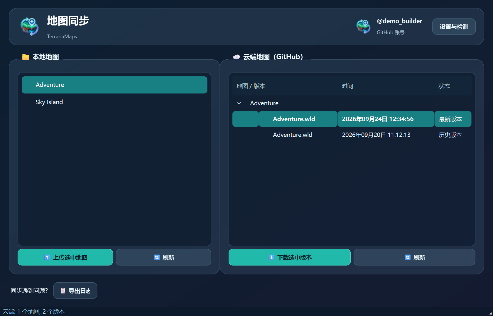
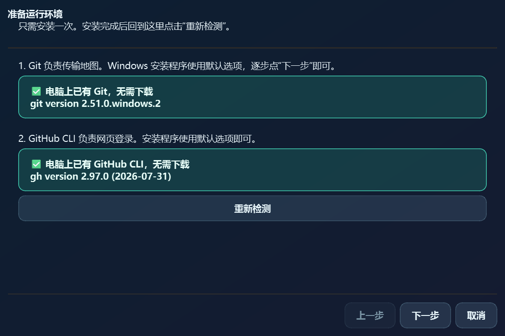
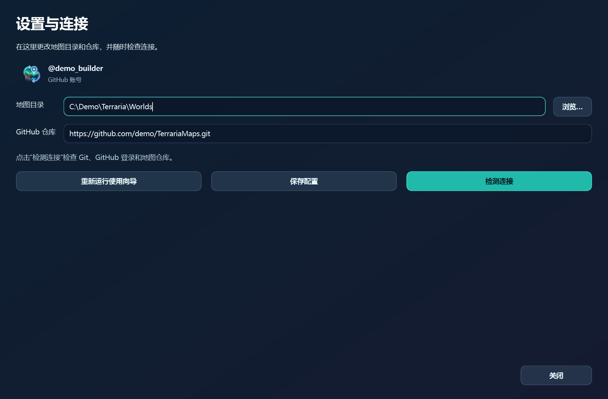

# 🗺️ 泰拉瑞亚地图同步助手

一个 Windows 桌面工具：选择本地地图即可上传，选择云端历史版本即可下载。地图和备份文件一起同步；下载前会把原有本地文件保存到 `Worlds/.TerrariaMapSyncBackups/`。

## 运行时预览

以下截图使用演示地图和演示账号，不包含真实存档或仓库信息。

| 地图与版本 | 首次使用向导 | 设置与连接检测 |
| --- | --- | --- |
|  |  |  |

## 第一次使用

1. 从 [Releases](../../releases) 下载 `TerrariaMapSync.exe`，双击启动。程序是单文件窗口应用，不需要安装 Python，也不会弹出控制台。
2. 首次启动会自动打开使用向导。它会检测 **Git** 和 **GitHub CLI**；已安装时明确显示“无需下载”，缺少时提供官方下载链接。使用安装程序的默认选项完成安装，然后点“重新检测”。
3. 点击“打开浏览器登录”，程序会直接打开默认浏览器中的 GitHub 授权页面。一次性验证码由 GitHub CLI 复制到剪贴板；授权后返回向导点击“重新检测登录”。如浏览器未出现，可以点击“重新打开登录页面”。应用使用 HTTPS 和 GitHub CLI 登录，**不需要生成或配置 SSH 密钥**。
4. 选择 Terraria 的 `Worlds` 文件夹，填入地图仓库地址，例如 `https://github.com/owner/TerrariaMaps.git`，点击“检测仓库连接”。成功后点“完成”。

还没有地图仓库时，可以在向导里打开 GitHub 的新建仓库页面。建议创建 **Private** 仓库、勾选初始化 README，并在仓库设置中邀请朋友为协作者。每位朋友在自己的电脑上运行一次向导，填写同一个仓库地址。

## 日常同步

- **开服者上传：**关闭游戏，左侧选中地图，点击“上传选中地图”。每次上传保留一个按时间命名的云端版本；`.wld.bak` 和 `.wld.bak2` 若存在会一并上传。
- **其他人下载：**关闭游戏，右侧选中版本，点击“下载选中版本”。默认选中最新版本，也可以选历史版本。旧的本地文件会自动备份。
- **获取更新：**点击右侧“刷新”从 GitHub 拉取最新版本列表。上传或下载本身也会先拉取最新状态。

窗口右上角显示当前 GitHub 账号。点击“设置与检测”可以查看和修改地图目录、仓库地址，重新检测 Git、登录与仓库连接，或随时重新运行首次使用向导。遇到问题可从主界面导出日志。

## 开发与构建

使用 Python 3.10+。Windows 上可运行：

```powershell
python -m pip install -r requirements.txt
python main.py
python -m unittest discover -s tests -v
```

开发环境中也可双击 `启动助手.vbs` 静默启动（默认查找 `terraria-sync` Conda 环境）。安装 PyInstaller 后，运行 `./build.ps1` 生成无控制台的 `dist/TerrariaMapSync.exe`。构建使用 `assets/app.ico` 作为程序图标。

应用配置和日志保存在 `%APPDATA%/TerrariaMapHelper/`。GitHub 凭据由 GitHub CLI 管理，应用不保存令牌，也不修改全局 Git 凭据设置。
